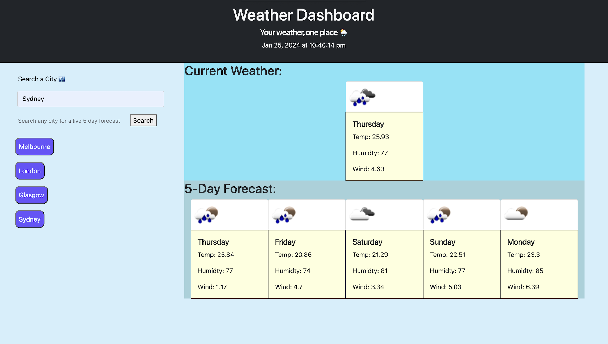

# 5 Day Weather Forecast

## Description

This web-application is designed to enable the user to search any major city in thw world and recieve the current weather. Listing the Temperatrue, the Humidity and the Wind Speed. Displaying a 5 day forecast of the weather at the click of a button. It was designed to allow users to access said information easily and efficiently on the go.

Whilst building this application it became abundantly clear how important the use of Third Party API's is in Web Developement. The correct implementation of the data recieved is key to having a user-friendly and informative application. 

## Usage

Navigate to the GitHub pages URL below to begin using this application - 

- https://eddiedpayne.github.io/Weather_Forecast/

## Contributions

Here at bookBase we welcome contributions from the online community! 
If you'd like to enhance the experience or you have any questions or feedback, please don't hesitate to reach out.

## License

This project is licensed under the MIT License. Feel free to use, modify, and distribute it as per the terms of the license associated with this repository.

Thank you for using this application! We hope it enhances your weather forecast experience. 

## Features 

With a click of a button search any desired city to get the current weather as well as five-day forecast. 

Each search returns the Temperature, Humidty and Wind-speed. 

## APIs:

https://api.openweathermap.org/